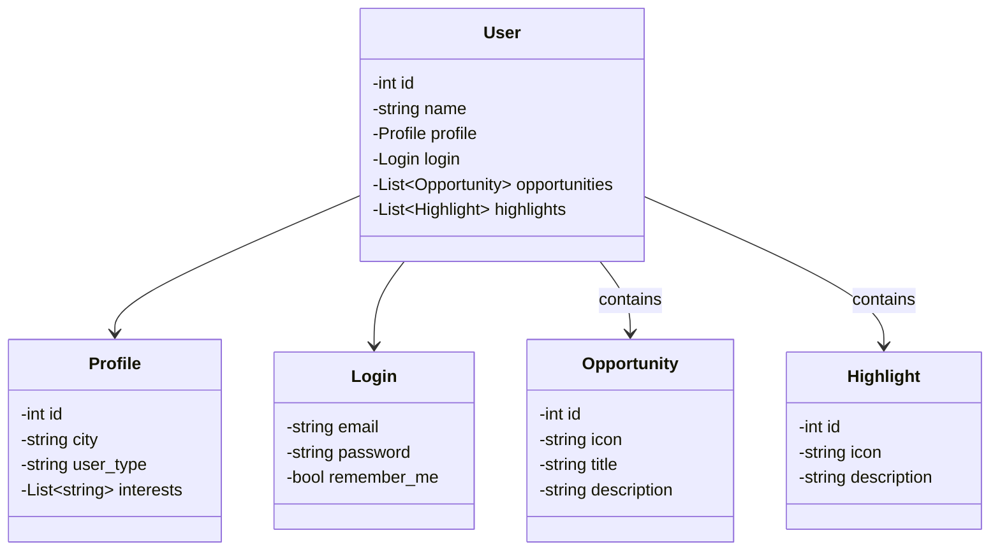

# Decola Tech Avanade
Java RESTful API criada para o Decola Tech Avanade

# Elas Code API

  

Java RESTful API desenvolvida como base para a plataforma Elas Code, com foco no cadastro de usuárias, perfis personalizados, oportunidades e destaques da comunidade.

## Principais Tecnologias

- **Java 21**: Utiliza a versão mais recente e estável do Java, com melhorias de desempenho e sintaxe moderna;
- **Spring Boot 3**: Framework que simplifica a criação de APIs REST com autoconfiguração e facilidade de desenvolvimento;
- **Spring Data JPA**: Responsável por mapear as entidades e simplificar a comunicação com o banco de dados relacional;
- **H2 Database**: Banco de dados em memória usado para testes e desenvolvimento local;
- **OpenAPI (Swagger)**: Geração de documentação automática e interativa da API REST;
- **VS Code**: Ambiente de desenvolvimento ágil, leve e com suporte ao Java Spring.

## Estrutura dos Dados

A API permite o cadastro de usuárias com informações de perfil, login, oportunidades e destaques.

## Diagram de classes

## Exemplo de JSON (POST /users)
{
  "name": "Ana Clara",
  "profile": {
    "city": "Recife",
    "user_type": "comum",
    "interests": ["ciência de dados", "front-end", "mentorias"]
  },
  "login": {
    "email": "ana@example.com",
    "password": "123456",
    "rememberMe": true
  },
  "opportunities": [
    {
      "title": "Programa de Mentoria",
      "icon": "https://cdn-icons-png.flaticon.com/512/1055/1055687.png",
      "description": "Sessões semanais com mulheres seniores da área tech."
    }
  ],
  "highlights": [
    {
      "icon": "https://cdn-icons-png.flaticon.com/512/1077/1077012.png",
      "description": "Mais de 2.000 mulheres impactadas em 2024!"
    }
  ]
}

## H2 Console
http://localhost:8080/h2-console

## IMPORTANTE

Este projeto foi desenvolvido com fins educacionais para estudo de APIs REST com Spring Boot, e pode ser evoluído para uso com PostgreSQL, autenticação JWT, e deploy em serviços como Railway ou Render.

